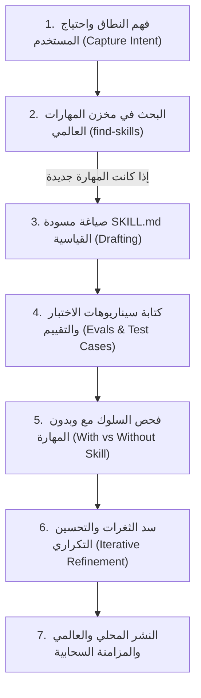

# Skill Creator (Antigravity & Claude Adapted)

A comprehensive engine for creating new agent skills, evaluating their behavior, and iteratively refining them to production-grade quality within the Antigravity & Claude ecosystem.

---

## High-Level Skill Creation Lifecycle



---

## 1. التقاط النية وتحديد المتطلبات (Capture Intent)

ابدأ بفهم عميق للهدف التقني:
1. **ما الذي يجب أن تمكّن هذه المهارة الوكيل من تنفيذه؟** (تحويل بيانات، معمارية كود، فحص أمان، بناء واجهات).
2. **متى يجب أن تُستدعى هذه المهارة تلقائياً؟** (الكلمات المفتاحية وسياق المستخدم).
3. **ما هي المخرجات المتوقعة؟** (كود، تقرير Markdown، ملفات تكوين).
4. **هل المهارة تحتاج اختبارات سلوكية؟** (المهارات البرمجية تتطلب اختبارات قطعية؛ المهارات الإبداعية تتطلب تقييماً نوعياً).

---

## 2. الهيكلة القياسية للمهارة (Skill Anatomy)

يجب أن تتبع أي مهارة هيكل التحميل المتدرج (Progressive Disclosure):

```text
skill-name/
├── SKILL.md (إلزامي — الترويسة والتعليمات الأساسية < 500 سطر)
└── Bundled Resources (اختياري)
    ├── scripts/    # سكربتات وأكواد تنفيذية مؤتمتة
    ├── references/ # وثائق إضافية يتم استدعاؤها عند الحاجة فقط
    └── assets/     # قوالب وأيقونات وملفات ثابتة
```

### الترويسة القياسية الإلزامية (YAML Frontmatter):
```markdown
---
name: skill-name
description: "شرح دقيق لما تقوم به المهارة، مع تضمين الكلمات والمواقف التي يجب تفعيلها عندها بشكل صريح وقاطع لمنع تجاهل الموديل لها (Pushy Description)."
---
```

---

## 3. معايير كتابة التعليمات (Writing Patterns)

1. **استخدام صيغة الأمر المباشر (Imperative Form):** (قم بـ X، لا تفعل Y، تحقق من Z).
2. **شرح الأسباب (Theory of Mind):** توضيح *لماذا* هذا القيد مهم بدلاً من الاكتفاء بالأوامر الجافة.
3. **تحديد قوالب المخرجات بشكل صارم:**
   ```markdown
   ## صيغة المخرجات الإلزامية
   # [عنوان المخرج]
   - **الملخص التنفيذي:**
   - **النتائج الأساسية:**
   ```
4. **أمثلة واقعية (Input/Output Pairs):**
   ```markdown
   **مثال:**
   - المدخل: تطبيق مصادقة JWT.
   - المخرج: فحص انتهاء الصلاحية والتوقيع المشفر وتأمين المفاتيح في متغيرات البيئة.
   ```

---

## 4. دورة الاختبار والتقييم السلوكي (Evaluation Loop)

للتحقق من فعالية المهارة، يتم تشغيل سيناريوهات مقارنة:
1. **تشغيل مع المهارة (With-Skill Run):** تزويد الوكيل بمسار المهارة وملاحظة التزامه بالقواعد.
2. **تشغيل بدون المهارة (Baseline Run):** تشغيل نفس الطلب بدون المهارة وملاحظة الأخطاء الشائعة والالتفافات.
3. **سد الثغرات (Refactor):** تعديل نص المهارة لسد أي ثغرة أو تبرير خاطئ قد يستخدمه النموذج.

---

## 5. النشر والمزامنة التلقائية (Deployment & Sync)

بمجرد اعتماد المهارة:
1. يتم حفظها محلياً في `.agents/skills/<skill-name>/SKILL.md`.
2. يتم نسخها عالمياً إلى `C:\Users\Kt\.gemini\config\skills/<skill-name>/SKILL.md`.
3. يتم إدراجها في خطاف العمل المناسب في `HOOKS_GUIDE.md`.
4. تشغيل `python .agents/sync_global_ecosystem.py` لتحديث الإكسيل ومكتبة الأوامر ومزامنة GitHub.
